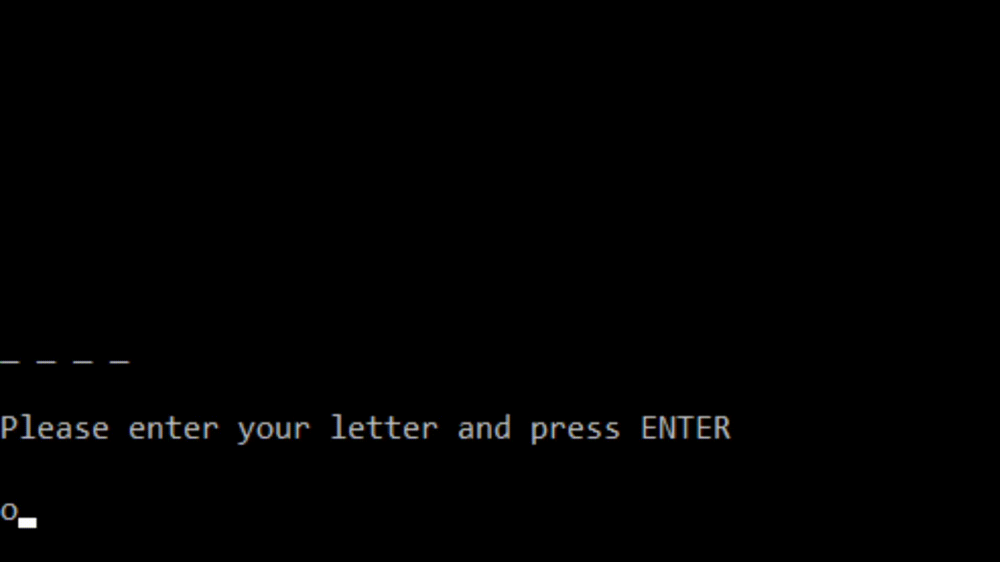

# 26-05-2020

Übungsaufgabe vom 25.05.2020 für die Studierenden des Java II Seminars der Universität zu Köln

### 📝 Aufgabe:

Ziel dieser Aufgabe ist es ein kleines [Hangman/Galgenmännchen-Spiel](https://de.wikipedia.org/wiki/Galgenm%C3%A4nnchen) für die Eingabe-Konsole zu entwickeln.

Musterlösung GIF

Tipps ⚠️:

 

    
### ℹ️ Resourcen:
Hier noch ein paar nützliche 📃Artikel, 🖊️Threads und 🎥Videos

- [🎥 Börges Seminar Video](https://uni-koeln.sciebo.de/s/CnL5Cg1opl8QceE)

- [📃 ]()

- [🖊️ ]()

